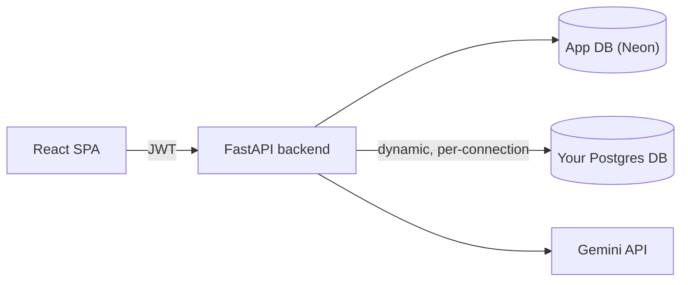

# AI SQL Assistant

Ask your PostgreSQL database questions in plain English. Connect your own database, get AI-generated SQL you can trust (validated, read-only, explained), see results as tables and charts, upload PDFs to populate tables, and keep a full history of every conversation.

Built as a full-stack portfolio project to demonstrate practical AI integration, backend/database engineering, authentication, and secure SQL execution — deliberately scoped to stay understandable end-to-end rather than reaching for infrastructure it doesn't need.

## Features

- **Auth** — register/login with JWT, bcrypt-hashed passwords, each user's data (connections, chats, saved queries) fully isolated.
- **Bring your own database** — connect any PostgreSQL database by host/port/credentials or a connection string; schema (tables, columns, primary keys, foreign keys) is discovered automatically via `SQLAlchemy.inspect()` and cached.
- **Natural language → SQL** — every prompt is turned into SQL grounded in your actual schema, explained in plain English, and shown with copy/collapse controls.
- **Secure SQL execution** — an allow-list validator permits only `SELECT`/`WITH` queries, blocks stacked statements and a keyword blocklist (`INSERT`, `DROP`, `pg_sleep`, ...), and forces a row `LIMIT`; execution itself runs inside a read-only transaction with a hard statement timeout.
- **Results, charts, exports** — a result table plus an auto-suggested bar/line/pie chart (switchable), with CSV, PNG, and formatted-PDF-report export.
- **Chat history & saved queries** — every turn (prompt, SQL, explanation, results, chart, timestamp) is persisted; search and delete conversations, or bookmark a query to re-run later.
- **PDF → structured data** — upload an invoice/product list/sales report, the AI extracts structured records into an **editable preview** you approve before anything is inserted (parameterized, never string-built SQL).
- **Schema Viewer** — a dedicated page listing every table's columns, primary keys, and foreign keys.
- **Polished UX** — responsive SaaS-style dashboard, dark mode, loading states, and a typing indicator while the AI responds.

## Live demo

Click **"Try with sample data"** on the Connect Database page to start chatting instantly, without connecting your own Postgres database. It attaches a shared, read-only e-commerce dataset (200 customers, 80 products, 1,000 orders across 2023–2025) to your account and drops you straight into chat with 5 example questions to try. See [`backend/demo/README.md`](backend/demo/README.md) for the dataset itself and how to stand it up.

## Screenshots

| Chat | Schema Viewer |
|---|---|
|  |  |

| Database Connections | Register (light mode) |
|---|---|
|  |  |

## Tech Stack

| Layer | Choice |
|---|---|
| Frontend | React, TypeScript, Vite, Tailwind CSS, React Router, Recharts |
| Backend | FastAPI, SQLAlchemy, Pydantic |
| Database | PostgreSQL (Neon in production) |
| Auth | JWT (PyJWT) + bcrypt (passlib) |
| AI | Google Gemini (`gemini-flash-latest`, JSON-mode) |
| PDF | pdfplumber (extraction), ReportLab + Matplotlib (report generation) |
| Deployment | Vercel (frontend), Render (backend), Neon (database) |

No Docker, Kubernetes, microservices, Kafka, or Redis — this is a standard three-tier app, kept intentionally simple to build in 2-3 weeks and explain confidently in an interview. See [`docs/ARCHITECTURE.md`](docs/ARCHITECTURE.md) for the full system diagram and the reasoning behind it.

## Folder Structure

```
AISqlAssistant/
  frontend/     React + TypeScript + Vite + Tailwind
    src/
      api/           axios client + one module per resource
      context/        Auth, Theme, Connection (React Context, no Redux)
      pages/          one file per route
      components/     grouped by feature (chat, connections, pdf, schema, savedQueries, common)
  backend/      FastAPI + SQLAlchemy
    app/
      models/         SQLAlchemy ORM models
      schemas/        Pydantic request/response models
      core/           security (hashing, JWT) + shared dependencies
      services/       AI, SQL validation/execution, schema discovery, encryption, PDF, export
      api/routes/      one router per resource
  database/     sample e-commerce schema + seed data + load instructions
  docs/         architecture diagram, API reference, deployment guide, screenshots
```

## Architecture



The backend maintains its own metadata database (users, connections, chats, saved queries) separately from the arbitrary external databases users connect to — those are reached through short-lived, per-request connections built from encrypted stored credentials. Full write-up: [`docs/ARCHITECTURE.md`](docs/ARCHITECTURE.md). Endpoint reference: [`docs/API.md`](docs/API.md).

## Installation

### Prerequisites
- Python 3.11+
- Node.js 20+
- A PostgreSQL database (local install, Docker, or a free [Neon](https://neon.tech) project) — you need **two**: one for the app's own data, one to use as the "connected" target database (or reuse the [sample e-commerce database](database/README.md))
- A [Gemini API key](https://aistudio.google.com/app/apikey) (only required for AI SQL generation and PDF extraction — everything else works without one)

### Backend

```bash
cd backend
python3 -m venv .venv && source .venv/bin/activate
pip install -r requirements.txt
cp .env.example .env   # fill in APP_DATABASE_URL, JWT_SECRET_KEY, ENCRYPTION_KEY, GEMINI_API_KEY, etc.
                       # the app refuses to start on a placeholder secret — see app/config.py
uvicorn app.main:app --reload
```

Tables are created automatically on startup. API docs available at `http://localhost:8000/docs`.

### Frontend

```bash
cd frontend
npm install
cp .env.example .env   # VITE_API_BASE_URL=http://localhost:8000
npm run dev
```

App available at `http://localhost:5173`.

### Sample database (optional but recommended)

```bash
createdb demo_ecommerce
psql -d demo_ecommerce -f database/schema.sql
psql -d demo_ecommerce -f database/seed_data.sql
```

Then connect to it from the app's "Connect Database" page. See [`database/README.md`](database/README.md) for Neon instructions and example prompts to try.

## Environment Variables

**Backend** (`backend/.env`, see `backend/.env.example`):

| Variable | Purpose |
|---|---|
| `APP_DATABASE_URL` | Postgres connection string for the app's own data |
| `JWT_SECRET_KEY` | Signs auth tokens |
| `ENCRYPTION_KEY` | Fernet key encrypting stored target-DB passwords at rest |
| `GEMINI_API_KEY` / `GEMINI_MODEL` | AI provider config |
| `SQL_STATEMENT_TIMEOUT_MS` / `SQL_DEFAULT_ROW_LIMIT` | SQL execution safety limits |
| `CORS_ORIGINS` | Allowed frontend origin(s) |
| `DEMO_DATABASE_URL` | Backs the "Try with sample data" button — see [`backend/demo/README.md`](backend/demo/README.md). Leave empty to disable it. |

**Frontend** (`frontend/.env`, see `frontend/.env.example`):

| Variable | Purpose |
|---|---|
| `VITE_API_BASE_URL` | Backend API base URL |

## Deployment

Frontend → Vercel, backend → Render, app database → Neon. Config files (`frontend/vercel.json`, `backend/render.yaml`) are already in the repo — full step-by-step in [`docs/DEPLOYMENT.md`](docs/DEPLOYMENT.md).

## Code Quality

- **Clean architecture**: routes stay thin — all business logic (SQL validation, AI calls, schema discovery, PDF parsing) lives in single-purpose `services/` modules that are independently testable and independently explainable.
- **Security by construction**: passwords bcrypt-hashed; target-DB credentials Fernet-encrypted at rest; SQL allow-listed, forced-`LIMIT`, read-only-transaction, and statement-timeout as layered defenses; PDF-driven inserts always parameterized.
- **Typed end-to-end**: Pydantic schemas on the backend, TypeScript interfaces on the frontend mirroring them.
- **Every failure mode has a home**: invalid SQL, empty results, bad credentials, AI timeouts, an offline database, and unparseable PDFs each produce a specific, human-readable message instead of a generic error.

## Future Improvements

- Refresh tokens / server-side session invalidation (current auth is stateless JWT — simple, but "logout" only clears the client-side token)
- Streaming AI responses instead of a single request/response round trip
- Multi-database "join across connections" queries
- Role-based read-only database credentials enforced at the Postgres level, not just the app layer
- Automated test suite (pytest for the backend services, Vitest/RTL for frontend components)

## Interview Talking Points

This project is designed so each of these is a two-minute answer, not a slide:

- **Auth flow** — registration → bcrypt hash → JWT issuance → Bearer-token verification on every request (`core/security.py`, `core/deps.py`)
- **Dynamic database connections** — why the app maintains two separate Postgres roles (its own metadata DB vs. arbitrary target DBs) and how credentials are encrypted at rest and decrypted only to open a short-lived connection (`services/target_db.py`, `services/encryption.py`)
- **Schema discovery** — using `SQLAlchemy.inspect()` instead of hand-written `information_schema` queries (`services/schema_introspector.py`)
- **Prompt engineering** — how the schema gets serialized into the AI prompt, why JSON-mode + a few-shot example keeps output parseable (`utils/prompt_templates.py`)
- **SQL validation** — the layered defense between "AI-generated text" and "SQL that actually runs" (`services/sql_validator.py`, `services/sql_executor.py`)
- **PDF → DB pipeline** — why extraction and insertion are two separate API calls, with the editable preview as the safety gate in between (`api/routes/pdf.py`)
- **Chart selection** — a small rule-based heuristic instead of another AI call (`utils/chart_suggester.py`) — a deliberate simplicity trade-off
