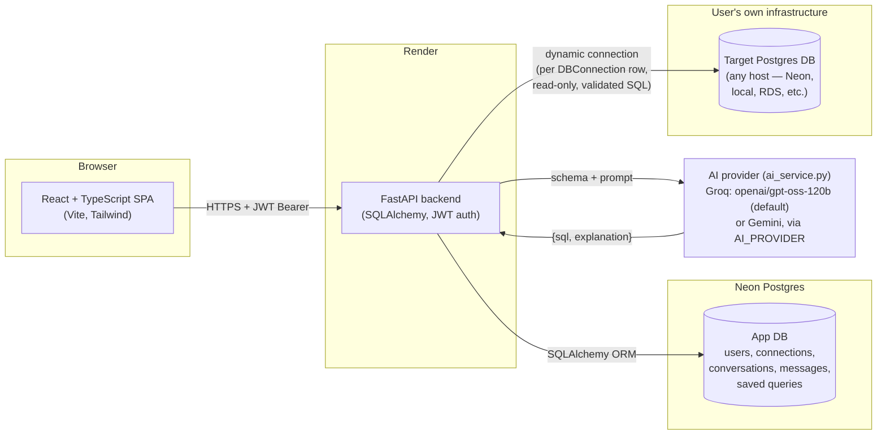

# Architecture

## System overview

Deployed as three independent pieces — **Vercel** (frontend), **Render** (backend), **Neon** (app database) — plus the AI provider and whichever Postgres database the user connects. Nothing here needs Docker, Kubernetes, or a message queue: it's a standard three-tier web app with one extra external dependency (the user's target database) that the backend talks to dynamically at request time.

## Two Postgres roles

This is the one architectural idea worth explaining clearly in an interview:

1. **App DB** — the application's own data: `users`, `db_connections` (encrypted target-DB credentials + cached schema), `conversations`, `messages`, `saved_queries`. Accessed through a single long-lived SQLAlchemy engine (`app/database.py`), like any normal backend.
2. **Target DB** — the arbitrary external Postgres database a user connects on the "Connect Database" page. The backend never keeps a persistent connection to it; instead, `services/target_db.py` builds a fresh connection URL (decrypting the stored password) and opens a short-lived engine per request in `sql_executor.py` and `schema_introspector.py`. This is what lets each user query a completely different, independently-hosted database through the same API.

## Request pipeline: natural language → results

`POST /api/chat/query` (`backend/app/api/routes/chat.py`) orchestrates five independently testable modules, each of which turns its own failure mode into a friendly, persisted error message instead of a raw 500:

1. **Schema discovery** (`schema_introspector.py`) — `SQLAlchemy.inspect()` on the target DB, cached on the `DBConnection` row.
2. **AI generation** (`ai_service.py`) — schema + prompt + short conversation history → provider JSON-mode call → `{sql, explanation}`. Groq and Gemini are both implemented behind one `_chat_json()` entry point; `AI_PROVIDER` picks which, and both raise the same error vocabulary so the eval harness classifies failures identically.
3. **SQL validation** (`sql_validator.py`) — allow-list check (SELECT/WITH only, no stacked statements, keyword blocklist, forced `LIMIT`).
4. **Execution** (`sql_executor.py`) — short-lived connection, `SET TRANSACTION READ ONLY`, Postgres `statement_timeout`, JSON-safe row serialization.
5. **Persistence** — the full turn (prompt, SQL, explanation, results, chart type, timing) is saved as one `Message` row so chat history is just a normal read query.

## PDF ingestion pipeline

`POST /api/pdf/upload` extracts text (`pdfplumber`) and asks the AI to structure it into JSON records matching the target table's real columns (from the same schema cache used above) — nothing is written yet. The frontend shows an editable preview grid; only when the user calls `POST /api/pdf/confirm` does `pdf_service.insert_records()` run a parameterized bulk `INSERT` (bound parameters, never string-built SQL) inside a transaction.

## Frontend structure

React Context (`AuthContext`, `ThemeContext`, `ConnectionContext`) instead of Redux/Zustand — there's little enough shared state that a reducer library would be pure overhead. Pages own their own data fetching via a thin `api/*.ts` layer that wraps `axios` with a JWT interceptor; components are grouped by feature (`components/chat`, `components/connections`, `components/pdf`, ...) rather than by type.
